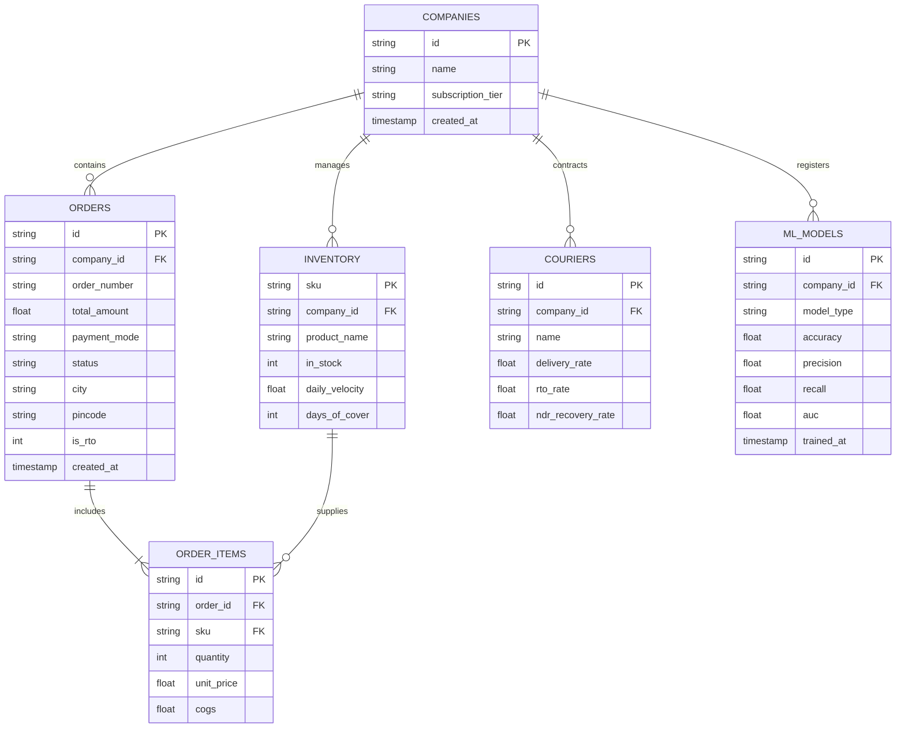

# DataNexus | Full-Stack E-Commerce Analytics & Logistics Operating Suite

[](https://github.com/kp056249-sudo/Krishna)
[](https://www.typescriptlang.org/)
[](https://react.dev/)
[](https://nodejs.org/)
[](LICENSE)

An authentic, interview-ready full-stack portfolio platform built to solve Indian Direct-to-Consumer (D2C) e-commerce unit economics and Return-to-Origin (RTO) courier leakages.

---

## 1. Problem Statement

Indian D2C brands frequently operate on thin or negative net margins despite high top-line Gross Merchandise Value (GMV). Two major factors cause this discrepancy:
1. **Cash on Delivery (COD) Return-to-Origin (RTO)**: Across Tier 2 & Tier 3 postal circles, 20–35% of COD shipments are returned undelivered upon arrival. Brands lose both forward freight (₹70–₹110) and reverse logistics penalties (₹140–₹210) plus packaging and damaged inventory.
2. **Gross vs Net Realization Gap**: Standard accounting dashboards report invoice GMV rather than bank-realized net cash after COGS, payment gateway fees, forward logistics, reverse RTO deductions, and GST.

**DataNexus** provides an end-to-end operational suite that audits unit economics, predicts RTO probability using supervised machine learning, models demand with seasonal time-series, and allows safe ad-hoc exploration through a read-only SQL studio.

---

## 2. System Architecture

```mermaid
flowchart TD
    subgraph Client ["Client Layer (React 18 + Vite + Tailwind)"]
        UI["Analytics UI & Dashboards"]
        SQL_UI["SQL Studio & NL-to-SQL"]
        ML_UI["ML Studio & Regression Lab"]
        FC_UI["Sales Forecast (Holt-Winters)"]
        ERR["React Error Boundary"]
    end

    subgraph Server ["Server Layer (Node.js + Express + TypeScript)"]
        AUTH["Auth & Multi-Tenant Middleware"]
        AST_GUARD["SQL Read-Only AST Guard"]
        UNIT_ECON["Unit Economics Engine"]
        ML_PIPE["Logistic Regression Pipeline"]
        TS_ENGINE["Time-Series Forecasting Engine"]
        RATE["Rate Limiter & Helmet"]
    end

    subgraph DataStore ["Storage & Data Engines"]
        PG["PostgreSQL / Supabase (Relational Analytics)"]
        FS["Cloud Firestore (Tenant Configs & Logs)"]
        BENCH["10,000-Order Deterministic Benchmark"]
    end

    subgraph Integrations ["External APIs & Gateways"]
        GEMINI["Google Gemini 2.5 (Analytics & NL2SQL)"]
        META["Meta WhatsApp Cloud API (v21.0 Sandbox)"]
        RZP["Razorpay Sandbox (HMAC-SHA256)"]
        SR["Shiprocket Logistics Connect"]
    end

    UI --> AUTH
    SQL_UI --> AST_GUARD --> PG
    ML_UI --> ML_PIPE --> BENCH
    FC_UI --> TS_ENGINE --> BENCH
    AUTH --> UNIT_ECON
    AUTH --> RATE
    Server --> FS
    Server --> GEMINI
    Server --> META
    Server --> RZP
    Server --> SR
```



---

## 3. Core Modules & Engineering Features

### A. Unit Economics & Consolidated Financials
Calculates realized bank cash for every order using a single centralized calculation engine (`server/utils/financialMetrics.ts` and `src/utils/financialMetrics.ts`):
$$\text{Realized Net Profit} = \text{GMV} - \text{COGS} - \text{ForwardShipping} - \text{GatewayFee} - \text{Packaging} - \text{GST} - \text{RTOPenalty}$$

### B. Supervised ML Pipeline (RTO Classification)
- **Features**: Payment mode (COD vs Prepaid), LOO target-encoded pincode risk, AOV tier, address quality score, and 3PL courier history.
- **Evaluation**: Chronological 80/20 train/test split.
- **Metrics**: Accuracy, Precision, Recall, F1-Score, and Trapezoidal ROC-AUC.
- **Diagnostics**: Full $2 \times 2$ Confusion Matrix and known failure mode disclosures.

### C. Ordinary Least Squares (OLS) & Residual Lab
- Closed-form OLS parameter estimation ($m = \frac{\text{Cov}(X,Y)}{\text{Var}(X)}$, $b = \bar{Y} - m\bar{X}$).
- Evaluates $R^2$, MSE, and RMSE on a sample of real order unit economics.
- **Residual Plot**: Diagnostic scatter plot of $e = y - \hat{y}$ vs predicted values to inspect homoscedasticity and check regression assumptions.

### D. Time-Series Sales & Demand Forecasting
- Multiplicative Holt-Winters seasonality modeling.
- Decomposes day-of-week demand cycles (identifies 25–30% weekend volume surge).
- Validated with out-of-sample **MAPE** (Mean Absolute Percentage Error) and **RMSE**.

### E. SQL Studio & AST Read-Only Guard
- AST regex and token validator permitting `SELECT` and CTE `WITH` queries.
- Strictly rejects DDL/DML mutations (`DROP`, `DELETE`, `INSERT`, `ALTER`, `TRUNCATE`, `UPDATE`).
- Pre-populated with 10 production interview queries (CTEs, Window Functions, Cohorts, NTILE).

---

## 4. Architectural Truth: Real vs Sandbox

| Capability | Status | Implementation Details |
| :--- | :---: | :--- |
| **10,000 Benchmark Dataset** | **Real** | Deterministic LCG generator modeling authentic Indian cities, pincodes, and COD economics (`server/data/ecommerceDataset.ts`). |
| **Unit Economics Engine** | **Real** | Single source of truth calculation module across all dashboard cards. |
| **SQL Read-Only Sandbox** | **Real** | Server AST keyword parser enforcing read-only constraints and row limits (`server/sqlEngine.ts`). |
| **ML Training & Diagnostics** | **Real** | Pure TypeScript logistic regression with 80/20 train/test split and confusion matrix (`server/services/rtoMLService.ts`). |
| **OLS & Residual Lab** | **Real** | Closed-form regression and visual residual plot (`src/components/analytics/LinearRegressionWorkspace.tsx`). |
| **Sales Forecasting** | **Real** | Day-of-week seasonality decomposition with MAPE/RMSE (`src/components/analytics/SalesForecastPage.tsx`). |
| **Google Gemini AI** | **Real** | Live integration via Google GenAI SDK for NL-to-SQL and copilot dialogues. |
| **Meta WhatsApp Briefings** | **Sandbox** | Formatted to Meta Cloud API v21.0 specs. Marked as Sandbox because business broadcasts require pre-approved Meta WABA templates. |
| **Razorpay Payments** | **Sandbox** | Full HMAC-SHA256 cryptographic verification in Razorpay Test Mode (`rzp_test_...`). |
| **Shiprocket Integration** | **API** | Token auth, auto-refresh, courier scorecard, and NDR handling (`server/services/shiprocketService.ts`). |

---

## 5. Database Schema & Entity Relationship Diagram (ERD)



---

## 6. Local Setup & Testing

### Prerequisites
- Node.js 18+ (tested on Node v20/v24)
- npm 9+

### Quick Start
```bash
# 1. Clone repository
git clone https://github.com/kp056249-sudo/Krishna.git
cd Krishna

# 2. Install dependencies
npm install

# 3. Configure environment
cp .env.example .env
# Fill in your GEMINI_API_KEY, RAZORPAY_KEY, etc.

# 4. Run automated test suite (Supertest + unit tests)
npm test

# 5. Start dev server (Client + Express backend concurrently)
npm run dev
```

### Production Build
```bash
npm run build
npm start
```

---

## 7. Render Deployment Guide

The platform is designed to deploy on [Render](https://render.com) as a single Web Service:

- **Build Command**: `npm run build`
- **Start Command**: `npm start`
- **Health Check Path**: `/api/health`
- **Node Environment**: `production`

### Required Environment Variables:
```env
PORT=3000
NODE_ENV=production
ENCRYPTION_KEY=your_32_byte_aes_gcm_hex_secret
GEMINI_API_KEY=your_google_gemini_api_key
RAZORPAY_KEY_ID=rzp_test_your_key_id
RAZORPAY_KEY_SECRET=your_razorpay_secret
```

---

## 8. Limitations & Future Roadmap

- **Geographic Density**: Pincode risk models rely on historical postal circle density; cold-start performance on remote PIN codes falls back to state averages.
- **Real-Time 3PL Webhooks**: Courier delivery status updates currently poll or process batch webhooks; integration with Kafka/SQS queues is planned for multi-million order streams.
- **Production Meta WhatsApp WABA**: Transitioning from Sandbox test accounts to a production Meta WhatsApp Business Account requires pre-registering HSM template message definitions in Meta Business Manager.

---

## 9. License

Distributed under the MIT License. Built with engineering rigor by Krishna Pandey.
